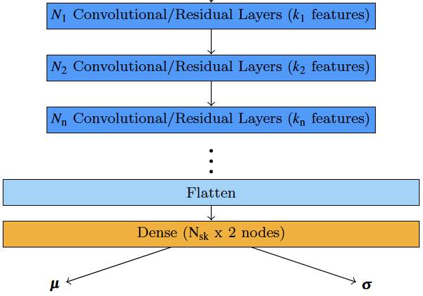

# Searching for optimal architecture for ResNet or ConvNet using Optuna grid search for 1d data


The repo helps you search for a optimal architecture for a given dataset Convolutional Neural Network or Residual Neural Network for 1d signals. 
The general architecture is each ConvNet/ResNet is divided into stages where features are kept fix at each one. Several layers at each stage increasing sequentially. For each trail either ConvNet or ResNet with given stages, layers and features at each stage is selected. In addition hyperparamters is also searched for such as learning rate and batch size. For example a two stage ResNet with two and four layers at each stage with 32 and 64 features/filters at each stage is shown as  
### ResNet [2 4] [32 64]

# Schematic of general architecture




# Applying  changes to grid search

To make chnages to the laid out grid search for architecture and hyper paramters please modify this part of section in file objective_func.py

```
     choose hyper parameters for model training
    initial_learning_rate = trial.suggest_float('lr', 1e-4, 0.5, log=True)
    #powers of two
    batch_size = np.power(2, trial.suggest_int("batch_size", 5, 10))
    #four stages, inspired by ResNet
    num_blocks = np.full(trial.suggest_int("num_blocks", 1, 2), 1, dtype=np.int32)
    
    features_per_block = np.ones(num_blocks.shape, dtype=np.int32)
    layers_per_block = np.ones(num_blocks.shape, dtype=np.int32)
    #the features at first stage keeping feature as power of two
    features_per_block[0] = np.power(2, trial.suggest_int("features_per_block1", 2, 5))
    layers_per_block[0] = trial.suggest_int("num_layers1", 1, 2)
    
    #layers at each stage, maximum
    max_layers_per_block = 4

    for ci in range(1,len(num_blocks)):
        features_per_block[ci] = trial.suggest_int("features_per_block"+str(ci+1), 
                                             features_per_block[ci-1], 
                                             features_per_block[ci-1]*2, 
                                             features_per_block[ci-1])

        #each stage choice between number of layers in 
        #previous stage and up to maximum value
        layers_per_block[ci] = trial.suggest_int("layers_per_block"+str(ci+1), 
                                             layers_per_block[ci-1], 
                                             max_layers_per_block)

    
    #suggest a network
    network = trial.suggest_categorical("network", ["ConvNet", "ResNet"])
```


# Usages
```main.py [-h] [--epochs EPOCHS] [--patience_epochs PATIENCE_EPOCHS] [--trails TRAILS] [--seed SEED] [--load_study LOAD_STUDY] [--dataset_file DATASET_FILE] [--study_file STUDY_FILE] ```


# Output for the command
 ``` python main.py --load_study False --study_file study.pkl  --epochs 20 --trails 10 ```


 epochs, trails,  patience_epochs =  20 10 10<br>
created study file<br>
[I 2023-11-07 19:22:22,470] A new study created in memory with name: no-name-bdd2786c-0b59-4ebc-90c2-c78fb116f6a7<br>
dataset.npy<br>

### ResNet [2 4] [32 64]<br>
number of batches = 7.8125<br>

Epoch 1 15.2 [sec] 30487.012000 0.415764 0<br>
Epoch 2 7.0 [sec] 1519144.960000 0.340026 1<br>
Epoch 3 7.1 [sec] 26603.620000 0.326824 0<br>
Epoch 4 6.7 [sec] 11.709255 0.310173 0<br>
Epoch 5 6.7 [sec] 11.628438 0.305226 0<br>
Epoch 6 6.7 [sec] 3.894254 0.304021 0<br>
Epoch 7 6.8 [sec] 5.434859 0.298892 1<br>
Epoch 8 7.0 [sec] 1126658.560000 0.304861 2<br>
Epoch 9 6.7 [sec] 3.099239 0.295664 0<br>
Epoch 10 6.7 [sec] 2.908993 0.294584 0<br>
Epoch 11 6.7 [sec] 4.521427 0.291933 1<br>
Epoch 12 6.7 [sec] 1031.194125 0.292859 2<br>
Epoch 13 6.7 [sec] 2.786365 0.289942 0<br>
Epoch 14 6.8 [sec] 2.764447 0.290485 0<br>
Epoch 15 6.8 [sec] 2.753260 0.288201 0<br>
Epoch 16 6.8 [sec] 3.866322 0.289719 1<br>
Epoch 17 6.7 [sec] 2.727962 0.288435 0<br>
Epoch 18 6.7 [sec] 513.564844 0.287538 1<br>
Epoch 19 6.7 [sec] 136.588203 0.288522 2<br>
Epoch 20 6.8 [sec] 52.063090 0.290753 3<br>
[I 2023-11-07 19:24:47,600] Trial 0 finished with value: 43647.39453125 and parameters: {'lr': 0.07641435988290146, 'batch_size': 7, 'num_blocks': 2, 'features_per_block1': 5, 'num_layers1': 2, 'features_per_block2': 64, 'layers_per_block2': 4, 'network': 'ResNet'}. Best is trial 0 with value: 43647.39453125.<br>

trail number = 1<br>
Best value: 43647.39453125, Best params: {'lr': 0.07641435988290146, 'batch_size': 7, 'num_blocks': 2, 'features_per_block1': 5, 'num_layers1': 2, 'features_per_block2': 64, 'layers_per_block2': 4, 'network': 'ResNet'}
saving study in to file study.pkl<br>


### ResNet [2 3] [32 64]
number of batches = 1.953125
Epoch 1 11.0 [sec] 6274357919.744000 0.886518 0<br>
........<br>
[I 2023-11-07 19:26:37,707] Trial 1 finished with value: 14073.416015625 and parameters: {'lr': 0.029168704673281753, 'batch_size': 9, 'num_blocks': 2, 'features_per_block1': 5, 'num_layers1': 2, 'features_per_block2': 64, 'layers_per_block2': 3, 'network': 'ResNet'}. Best is trial 1 with value: 14073.416015625.<br>

trail number = 2<br>
Best value: 14073.416015625, Best params: {'lr': 0.029168704673281753, 'batch_size': 9, 'num_blocks': 2, 'features_per_block1': 5, 'num_layers1': 2, 'features_per_block2': 64, 'layers_per_block2': 3, 'network': 'ResNet'}<br>
saving study in to file study.pkl<br>


### ConvNet [2] [8]<br>
number of batches = 1.953125<br>
Epoch 1 3.1 [sec] 203614920376.320007 1.379745 0<br>

[I 2023-11-07 19:27:02,401] Trial 2 finished with value: 117902.59375 and parameters: {'lr': 0.005381721772891036, 'batch_size': 9, 'num_blocks': 1, 'features_per_block1': 3, 'num_layers1': 2, 'network': 'ConvNet'}. Best is trial 1 with value: 14073.416015625.<br>

trail number = 3<br>
Best value: 14073.416015625, Best params: {'lr': 0.029168704673281753, 'batch_size': 9, 'num_blocks': 2, 'features_per_block1': 5, 'num_layers1': 2, 'features_per_block2': 64, 'layers_per_block2': 3, 'network': 'ResNet'}<br>
saving study in to file study.pkl<br>


### ConvNet [2 4] [16 32]<br>
number of batches = 7.8125<br>

Epoch 1 6.9 [sec] 2693463801.856000 0.641244 0<br>
..........<br>
Epoch 20 2.8 [sec] 2.651378 0.350648 0<br>
[I 2023-11-07 19:28:02,504] Trial 3 finished with value: 42422.05078125 and parameters: {'lr': 0.004493857248617635, 'batch_size': 7, 'num_blocks': 2, 'features_per_block1': 4, 'num_layers1': 2, 'features_per_block2': 32, 'layers_per_block2': 4, 'network': 'ConvNet'}. Best is trial 1 with value: 14073.416015625.<br>

trail number = 4<br>
Best value: 14073.416015625, Best params: {'lr': 0.029168704673281753, 'batch_size': 9, 'num_blocks': 2, 'features_per_block1': 5, 'num_layers1': 2, 'features_per_block2': 64, 'layers_per_block2': 3, 'network': 'ResNet'}<br>
saving study in to file study.pkl<br>


### ResNet [1 4] [16 32]<br>
number of batches = 31.25<br>
Epoch 1 12.1 [sec] 16112.469000 0.503134 0<br>

[I 2023-11-07 19:30:19,675] Trial 4 finished with value: 125646.375 and parameters: {'lr': 0.0015244371181319049, 'batch_size': 5, 'num_blocks': 2, 'features_per_block1': 4, 'num_layers1': 1, 'features_per_block2': 32, 'layers_per_block2': 4, 'network': 'ResNet'}. Best is trial 1 with value: 14073.416015625.<br>

trail number = 5<br>
Best value: 14073.416015625, Best params: {'lr': 0.029168704673281753, 'batch_size': 9, 'num_blocks': 2, 'features_per_block1': 5, 'num_layers1': 2, 'features_per_block2': 64, 'layers_per_block2': 3, 'network': 'ResNet'}<br>
saving study in to file study.pkl<br>


### ConvNet [1] [32]<br>
number of batches = 1.953125<br>
Epoch 1 3.3 [sec] 1099948573589.503906 2.447904 0<br>
Epoch 20 2.4 [sec] 5.607065 0.424946 0<br>
[I 2023-11-07 19:31:08,217] Trial 5 finished with value: 22428.26171875 and parameters: {'lr': 0.015774233357113494, 'batch_size': 9, 'num_blocks': 1, 'features_per_block1': 5, 'num_layers1': 1, 'network': 'ConvNet'}. Best is trial 1 with value: 14073.416015625.<br>

trail number = 6<br>
Best value: 14073.416015625, Best params: {'lr': 0.029168704673281753, 'batch_size': 9, 'num_blocks': 2, 'features_per_block1': 5, 'num_layers1': 2, 'features_per_block2': 64, 'layers_per_block2': 3, 'network': 'ResNet'}<br>
saving study in to file study.pkl<br>


### ConvNet [1 4] [16 16]<br>
number of batches = 0.9765625<br>
Epoch 1 4.5 [sec] 54329.084000 0.462086 0<br>
Epoch 20 1.4 [sec] 3.714748 0.429612 0<br>
[I 2023-11-07 19:31:39,124] Trial 6 finished with value: 7429.49658203125 and parameters: {'lr': 0.0002775059131499799, 'batch_size': 10, 'num_blocks': 2, 'features_per_block1': 4, 'num_layers1': 1,<br> 'features_per_block2': 16, 'layers_per_block2': 4, 'network': 'ConvNet'}. Best is trial 6 with value: 7429.49658203125.<br>
<br>
trail number = 7<br>
Best value: 7429.49658203125, Best params: {'lr': 0.0002775059131499799, 'batch_size': 10, 'num_blocks': 2, 'features_per_block1': 4, 'num_layers1': 1, 'features_per_block2': 16, 'layers_per_block2': 4, 'network': 'ConvNet'}<br>
saving study in to file study.pkl<br>


### ResNet [2] [4]<br>
number of batches = 7.8125<br>
Epoch 1 4.6 [sec] 4482.470500 0.378300 0<br>
Epoch 20 0.9 [sec] 30.107635 0.372391 5<br>
[I 2023-11-07 19:32:02,715] Trial 7 finished with value: 50778.3125 and parameters: {'lr': 0.21320972196439056, 'batch_size': 7, 'num_blocks': 1, 'features_per_block1': 2, 'num_layers1': 2, 'network': 'ResNet'}. Best is trial 6 with value: 7429.49658203125.<br>

trail number = 8<br>
Best value: 7429.49658203125, Best params: {'lr': 0.0002775059131499799, 'batch_size': 10, 'num_blocks': 2, 'features_per_block1': 4, 'num_layers1': 1, 'features_per_block2': 16, 'layers_per_block2': 4, 'network': 'ConvNet'}<br>
saving study in to file study.pkl<br>


### ConvNet [2 2] [16 32]<br>
number of batches = 7.8125<br>
Epoch 1 6.1 [sec] 160320744062.976013 8.803352 0<br>

Epoch 15 2.5 [sec] 63443017.728000 0.340874 9<br>
[I 2023-11-07 19:32:46,695] Trial 8 finished with value: 49819164672.0 and parameters: {'lr': 0.03179689199761305, 'batch_size': 7, 'num_blocks': 2, 'features_per_block1': 4, 'num_layers1': 2, 'features_per_block2': 32, 'layers_per_block2': 2, 'network': 'ConvNet'}. Best is trial 6 with value: 7429.49658203125.<br>

trail number = 9<br>
Best value: 7429.49658203125, Best params: {'lr': 0.0002775059131499799, 'batch_size': 10, 'num_blocks': 2, 'features_per_block1': 4, 'num_layers1': 1, 'features_per_block2': 16, 'layers_per_block2': 4, 'network': 'ConvNet'}<br>
saving study in to file study.pkl<br>


### ResNet [1] [8]<br>
number of batches = 0.9765625<br>
Epoch 1 2.6 [sec] 135388677013.503998 1.203094 0<br>
Epoch 20 0.7 [sec] 5.386303 0.447556 0<br>
[I 2023-11-07 19:33:03,254] Trial 9 finished with value: 10772.6064453125 and parameters: {'lr': 0.03482059722810703, 'batch_size': 10, 'num_blocks': 1, 'features_per_block1': 3, 'num_layers1': 1, 'network': 'ResNet'}. Best is trial 6 with value: 7429.49658203125.<br>

trail number = 10<br>
Best value: 7429.49658203125, Best params: {'lr': 0.0002775059131499799, 'batch_size': 10, 'num_blocks': 2, 'features_per_block1': 4, 'num_layers1': 1, 'features_per_block2': 16, 'layers_per_block2': 4, 'network': 'ConvNet'}<br>
saving study in to file study.pkl<br>

### Number of finished trials: 10<br>

### Best trial:<br>
  Value: 7429.49658203125<br>
  Params: <br>
lr: 0.0002775059131499799<br>
batch_size: 10<br>
num_blocks: 2<br>
features_per_block1: 4<br>
num_layers1: 1<br>
features_per_block2: 16<br>
layers_per_block2: 4<br>
network: ConvNet<br>
<br>


 
